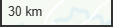

Un [template GRIST Carte Facile](https://grist.numerique.gouv.fr/o/sandbox-carte-facile/uD2ywACTtUMB/Template) est mis à votre disposition pour facilement mettre en oeuvre un document GRIST disposant de fonctionnalités cartographiques. Il propose un exemple minimal de table de données localisées et une page pour chacun des 4 cas d'usages du Widget Carte Facile décrit ci-dessous : [Cartographie](#cartographie), [Exploration](#exploration), [Localisation](#localisation) et [Exploration et localisation](#exploration-et-localisation) combinées. Cette version du widget propose également de nouvelles fonctions d'[Edition](#edition) des données de la table GRIST associée.

### Cartographie

Toutes les lignes sont représentées par un marqueur de localisation bleu () sauf l'unique ligne sélectionnée (première ligne valide du tableau par défaut) qui est représentée par un marqueur vert (). Le libellé s'affiche dans un popup lorsque la souris passe sur le marqueur. Il est alors possible de changer la sélection en cliquant sur le marqueur ; son popup devient fixe mais peut-être supprimé.

L'outil Map libre fournit les fonctions de navigation de base tels que :
* le déplacement (en bougeant la souris après un clic maintenu sur la carte),
* le bouton  pour le zoom avant,
* le bouton  pour le zoom arrière,
* le bouton  pour l'orientation,
* le bouton  pour sélectionner les données du fond Carte Facile.
* l'indicateur d'échelle .

Le widget Carte facile propose en complément :
* le bouton  pour une vue d'ensemble des marqueurs de toutes les lignes de la table,
* le bouton  pour se déplacer sur le marqueur de la ligne sélectionnée,
* le bouton  pour modifier les paramètres du widget.
* un nouveau <a href="https://fab-geocommuns.github.io/carte-facile-site/fr/documentation/ajouter-des-fonctionnalites/recherche/">contrôle de recherche</a> d'une adresse ou d'un point d'intérêt.

Le widget Carte facile permet de modifier les paramètres suivants :
* le **rayon d'agrégation** permet de gérer la représentation cartographique des lignes de la table dans les zones denses. Exprimé en pixels, il est utilisé par Map Libre pour aggréger, aux différentes échelles, les lignes se trouvant dans une même zone et les représenter par un cercle de taille et de couleur variable en fonction du nombre de lignes concernées ; le nombre de lignes agrégées est par ailleurs affiché au centre du cercle. Il suffit de cliquer sur le cercle pour zoomer sur les lignes agrégées. Il est possible de désactiver cette fonction d'agrégation en choisissant un rayon de 0 ou de faire varier le rayon pour trouver le niveau d'aggrégation optimal.

### Exploration

Ce cas d'usage revient à :
* ajouter à la cartographie déjà disponible dans la page, une vue (typiquement de type Fiche) associée à la même table,
* connecter cette vue au widget Carte Facile (via l'onglet Source de la vue).

Chaque ligne sélectionnée au travers du widget Carte facile sera alors visualisée dans la vue connectée qui pourra alors fournir tout ou partie des informations contenues dans les colonnes de la table. Le widget Carte facile permet ainsi l'exploration du contenu de la table.

### Localisation

Ce cas d'usage revient à :
* ajouter à la cartographie déjà disponible dans la page, une vue (typiquement de type Table) associée à la même table,
* connecter le widget Carte facile à cette nouvelle vue (via l'onglet Source du widget).

La sélection d'une ligne dans la vue ajoutée va induire un déplacement dans la cartographique permettant de sélectionner, localiser et zoomer sur le marqueur correspondant. Si la ligne sélectionnée n'est pas représentée cartographiquement, le widget carte Facile se contentera de déselectionner la ligne sélectionnées précédemment.

Le widget Carte facile devient alors un outil de **localisation cartographique** des données de la table.

### Edition

### Exploration et localisation

Il est possible de combiner les cas d'usage **Exploration** et **Localisation**. Dans ce cas, le bouton  permet de revenir à une vue d'ensemble des marqueurs de la table après une séquence de localisation pilotée par la vue à laquelle le widget est connecté. Les informations fournies dans cette vue peuvent être limitées à ce qui est nécessaire pour que l'utilisateur identifie de quoi il s'agit puisque le détail des lignes sélectionnées est fourni par la vue connectée au widget Carte facile. 
