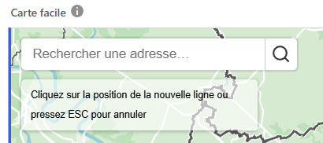
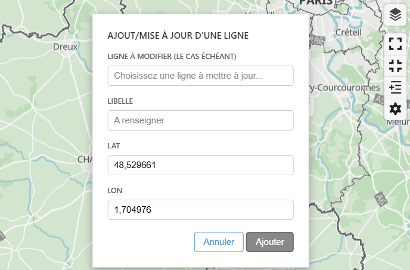
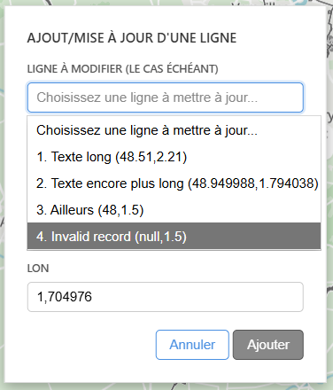
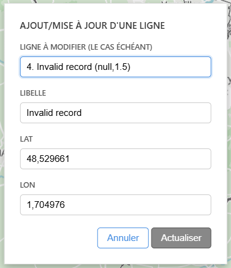
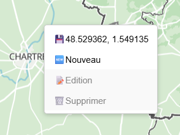
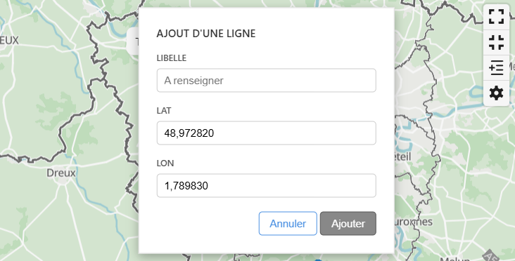
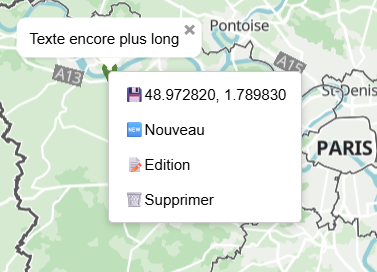
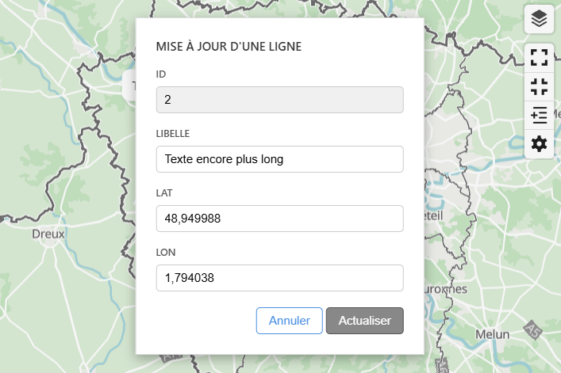
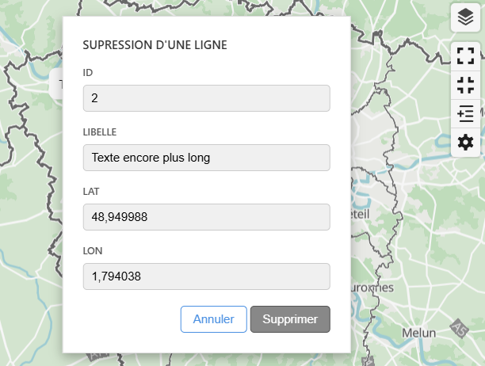

Un [template GRIST Carte Facile](https://grist.numerique.gouv.fr/o/sandbox-carte-facile/uD2ywACTtUMB/Template) est mis à votre disposition pour facilement mettre en oeuvre un document GRIST disposant de fonctionnalités cartographiques. Il propose un exemple minimal de table de données localisées et une page pour chacun des 4 cas d'usages du Widget Carte Facile décrit ci-dessous : [Cartographie](#cartographie), [Exploration](#exploration), [Localisation](#localisation) et [Exploration et localisation](#exploration-et-localisation) combinées. Cette version du widget propose également de nouvelles fonctions d'[Edition](#edition) des données de la table GRIST associée.

### Cartographie

Toutes les lignes sont représentées par un marqueur de localisation bleu () sauf l'unique ligne sélectionnée (première ligne valide du tableau par défaut) qui est représentée par un marqueur vert (). Le libellé s'affiche dans un popup lorsque la souris passe sur le marqueur. Il est alors possible de changer la sélection en cliquant sur le marqueur ; son popup devient fixe mais peut-être supprimé.

L'outil Map libre fournit les fonctions de navigation de base tels que :
* le déplacement (en bougeant la souris après un clic maintenu sur la carte),
* le bouton  pour le zoom avant,
* le bouton  pour le zoom arrière,
* le bouton  pour l'orientation,
* le bouton  pour sélectionner les données du fond Carte Facile (les limites administratives sont affichées par défaut sur le fond de carte mais les données cadastrales et les courbes de niveaux sont également disponibles, ainsi qu'un fond d'orthophotos aériennes),
* l'indicateur d'échelle : ,
* un nouveau <a href="https://fab-geocommuns.github.io/carte-facile-site/fr/documentation/ajouter-des-fonctionnalites/recherche/">contrôle de recherche</a> d'une adresse ou d'un point d'intérêt mise à disposition par Carte facile.

Le widget Carte facile propose en complément :
* le bouton  pour une vue d'ensemble des marqueurs de toutes les lignes de la table,
* le bouton  pour se déplacer sur le marqueur de la ligne sélectionnée,
* un nouveau bouton  permettant d'ajouter ou de mettre à jour une ligne en cliquant sur une position sur la carte (cf. [Edition](#edition)),
* le bouton  pour modifier les paramètres du widget.

Le widget Carte facile permet de modifier les paramètres suivants :
* le **rayon d'agrégation** permet de gérer la représentation cartographique des lignes de la table dans les zones denses. Exprimé en pixels, il est utilisé par Map Libre pour aggréger, aux différentes échelles, les lignes se trouvant dans une même zone et les représenter par un cercle de taille et de couleur variable en fonction du nombre de lignes concernées ; le nombre de lignes agrégées est par ailleurs affiché au centre du cercle. Il suffit de cliquer sur le cercle pour zoomer sur les lignes agrégées. Il est possible de désactiver cette fonction d'agrégation en choisissant un rayon de 0 ou de faire varier le rayon pour trouver le niveau d'aggrégation optimal.

### Exploration

Ce cas d'usage revient à :
* ajouter à la cartographie déjà disponible dans la page, une vue (typiquement de type Fiche) associée à la même table,
* connecter cette vue au widget Carte Facile (via l'onglet Source de la vue).

Chaque ligne sélectionnée au travers du widget Carte facile sera alors visualisée dans la vue connectée qui pourra alors fournir tout ou partie des informations contenues dans les colonnes de la table. Le widget Carte Facile permet ainsi l'exploration du contenu de la table tandis que la vue connectée, si elle est bien choisie, peut à la fois permettre de visualiser voire modifier des colonnes de la table dont le widget n'a même pas connaissance.

### Localisation

Ce cas d'usage revient à :
* ajouter à la cartographie déjà disponible dans la page, une vue (typiquement de type Table) associée à la même table que le widget,
* connecter le widget Carte facile à cette nouvelle vue (via l'onglet Source du widget).

La sélection d'une ligne dans la vue ajoutée va induire un déplacement dans la cartographique permettant de sélectionner, localiser et zoomer sur le marqueur correspondant. Si la ligne sélectionnée n'est pas représentée cartographiquement, le widget carte Facile se contentera de déselectionner la ligne sélectionnée précédemment.

Le widget Carte facile devient alors un outil de **localisation cartographique** des données de la table.

### Exploration et localisation

Il est possible de combiner les cas d'usage **Exploration** et **Localisation**. Dans ce cas, le bouton  permet de revenir à une vue d'ensemble des marqueurs de la table après une séquence de localisation pilotée par la vue à laquelle le widget est connecté. Les informations fournies dans cette vue peuvent être limitées à ce qui est nécessaire pour que l'utilisateur identifie de quoi il s'agit puisque le détail des lignes sélectionnées est fourni par la vue connectée au widget Carte facile.

### Edition

Après avoir cliqué sur le bouton , le pointeur de la souris prend la forme d'une cible  pour pointer la position d'une nouvelle ligne ou les nouvelles coordonnées d'une ligne existante. Un message d'instruction apparaît sous le contrôle de Recherche carte Facile pour expliquer à l'utilisateur ce qu'il a à faire. Il disparaîtra à l'issue de l'action initiée.

Un formulaire **Ajout/mise à jour d'une ligne** s'affiche en mode ajout au centre de la fenêtre du widget après avoir cliqué sur une position :

Il suffit de préciser le libellé associé à la position, éventuellement d'ajuster les coordonnées du clic, et de valider en cliquant sur **Ajouter**.

Il est également possible de sélectionner une ligne de la table au travers du menu déroulant de la zone **Ligne à modifier** :

Le formulaire passe alors en mode mise à jour en préservant les coordonnées cliquées ou modifiées par l'utilisateur à la place des coordonnées de la ligne sélectionnée.

Il est toujours possible d'ajouter le libellé et les coordonnées avant de cliquer sur le bouton **Actualiser**.

> Cette option d'édition est la seule qui permette d'utiliser le widget pour géoréférencer des lignes de la table qui n'ont pas de coordonnées valides

Le deuxième mécanisme d'édition proposé par le widget est basé sur un menu contextuel qui s'affiche lorsque l'on opère un clic droit sur la carte. Si le clic n'est pas opéré à proximité d'un marqueur représentant une ligne, seuls les deux premières actions sont disponibles :

Le premier élément du menu contextuel affiche les coordonnées **latitude, longitude** du point cliqué. La sélection de cet élément va permettre de copier les coordonnées dans le presse-papier pour les coller par ailleurs. Une instruction apparaît à l'issue de l'action pour informer l'utilisateur de l'effective copie des coordonnées ou malheureusement de son échec si le système n'a pas pu donner suite à la demande.

Le deuxième élément du menu contextuel permet d'ouvrir un formulaire d'**Ajout d'une ligne** pour lequel il suffit de préciser un libellé avant de cliquer sur le bouton **Ajouter**.

Lorsque le clic droit est opéré à proximité d'un ou plusieurs marqueurs, le menu contextuel propose deux actions supplémentaires qui concerneront la ligne dont le marqueur est le plus proche du point cliqué :

Le troisième élément du menu contextuel permet d'ouvrir un formulaire de **Mise à jour d'une ligne** affichant le numéro de ligne et le libellé de la ligne pointée associés à la position du pointé :

Il n'est pas possible ici de sélectionner une autre ligne.

Le quatrième élément du menu contextuel permet d'ouvrir un formulaire de **Suppresion d'une ligne** affichant également le numéro de ligne et le libellé de la ligne pointée associés à la position du pointé :

Aucune modification ne peut être apportée aux informations affichées puisque l'objectif est de contrôler qu'il s'agit bien de la ligne à supprimer avant de cliquer sur le bouton **Supprimer**.

> Il est important de noter qu'il est possible de fermer chaque formulaire du widget en cliquant sur le bouton **Annuler** ou, comme pour le menu contextuel, en cliquant en dehors du formulaire.

> Les labels du formulaire reprennent le nom original des colonnes de la table GRIST pour être adaptés au contexte de l'utilisateur ; ils seront donc différents de ceux présenter ici à titre d'illustration.

> Afin de visualiser la zone initialement cliquée ou une autre partie de la carte, il est possible de déplacer chaque formulaire avec un clic appuyé sur son nom. Un icône de déplacement apparaît d'ailleurs lorsque la souris passe sur le nom du formulaire pour indiquer cette possibilité.

